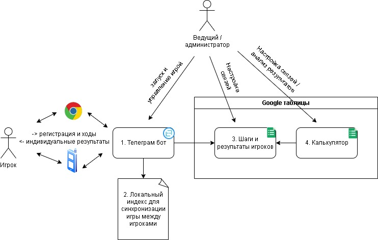
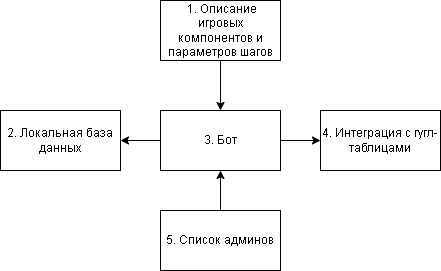
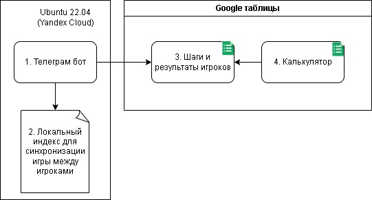
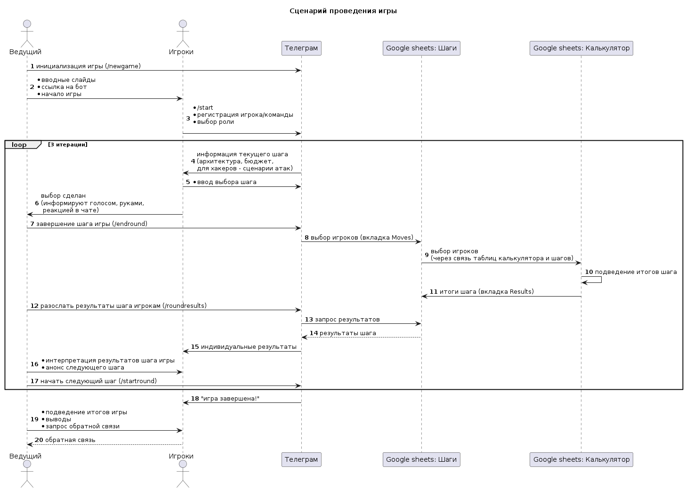

# Игра КИПР (Огнеборец) с применением Телеграм-бота

- [Игра КИПР (Огнеборец) с применением Телеграм-бота](#игра-кипр-огнеборец-с-применением-телеграм-бота)
  - [Автор](#автор)
  - [License / Лицензия](#license--лицензия)
  - [Общая архитектура](#общая-архитектура)
    - [Компоненты и взаимодействие](#компоненты-и-взаимодействие)
      - [Бот](#бот)
      - [Разработка](#разработка)
      - [Тестирование](#тестирование)
      - [Развёртывание](#развёртывание)
  - [Игра](#игра)
    - [Роли](#роли)
    - [Управляющие команды](#управляющие-команды)
    - [Настройка компонентов для новой игры](#настройка-компонентов-для-новой-игры)
    - [Последовательность команд для одной игры (инструкция для админа-игрока)](#последовательность-команд-для-одной-игры-инструкция-для-админа-игрока)
  - [TODO](#todo)


## Автор

Код телеграм-бота разработан Сергеем Соболевым.
Связаться в телеграм: [@sobolevsp](https://t.me/sobolevsp)

## License / Лицензия

Исходный код распространяется по лицензии GPL v3, см. файл LICENSE.

## Общая архитектура

### Компоненты и взаимодействие


#### Бот

Основные компоненты:



| Компонент                                          | Назначение                                                                                               | Комментарий                                                                                                                                                                                                                                          |
| -------------------------------------------------- | -------------------------------------------------------------------------------------------------------- | ---------------------------------------------------------------------------------------------------------------------------------------------------------------------------------------------------------------------------------------------------- |
| 1. Описание игровых компонентов и параметров шагов | содержит все тексты описания компонентов и атак, бюджеты защиты компонентов, общие бюджеты по шагам игры | реализация в файле *src/games/ogneborec.py*                                                                                                                                                                                                          |
| 2. Локальная база данных                           | используется для локального хранения статуса игры и синхронизации состояния                              | используется файловая база данных в json формате, пакет pysondb предоставляет удобный интерфейс для работы с такой базой.<br>Реализация в файле *src/persistence/stub.py*                                                                            |
| 3. Бот                                             | использует Telegram Bot API для обработки входящих сообщений, рассылает итоги каждого шага игры.         | реализован на базе пакета aiogram (https://pypi.org/project/aiogram/), т.к. используется функционал, имеющий статус экспериментального, в зависимостях (requirements.txt) фиксируется версия 3.0.0rc1. <br>Реализация в файле *src/kipr_game_bot.py* |
| 4. Интеграция с гугл-таблицами                     | записывает выбор пользователей, забирает итоги шага игры                                                 | для использования Google API (drive, spreadsheets) необходима сервисная учётная запись Google<br>Реализация в файле *src/google_sheets/report.py*                                                                                                    |
| 5. Список админов                                  | содержит список телеграм-пользователей, которые могут управлять играми                                   | реализация в файле *src/admins.py*                                                                                                                                                                                                                   |

Для работы с Google API используются сторонние библиотеки 
- google-api-python-client
- google_auth_oauthlib
- oauth2client  |


Примечание: 

Статьи по теме использованию Google API и интеграции с таблицами:
- https://habr.com/ru/articles/575160/
- https://habr.com/ru/articles/483302/

#### Разработка

Рекомендуется работать с кодом в Linux-подобном окружении. В качестве отладчика можно использовать VS Code или PyCharm.

0. необходимо предварительно установить 
   * системные пакеты python (версия 3.8.10 или новее), pip, pipenv
   * утилиты make, screen
1. для начала работы следует инициализировать локальное python-окружение, проще всего это сделать командой **make prepare** - она установит необходимые для проекта пакеты и инициализирует файлы локальной базы данных.
2. в VS Code следует открыть папку с кодом, для отладки можно добавить конфигурацию в .vscode/launch.json
   ```json
    {
      "name": "Python: Bot",
      "type": "python",
      "request": "launch",
      "program": "src/kipr_game_bot.py",
      "console": "integratedTerminal",
      "justMyCode": true
    }
   ```
3. следует создать файл .env, в котором задать значения переменных окружения (см. ниже)

#### Тестирование

Есть несколько интеграционных тестов для проверки функционала получения содержимого таблиц с помощью запросов (google query), но они используют конкретные таблицы с ограниченным доступом, для другого сервисного пользователя работать не будут.

#### Развёртывание



Для работы бот берёт информацию об отдельных настройках из переменных окружения
| Переменная окружения | Назначение                                                                                                                | Комментарий                                              |
| -------------------- | ------------------------------------------------------------------------------------------------------------------------- | -------------------------------------------------------- |
| BOT_TOKEN            | токен телеграм-бота                                                                                                       | для получения токена используется телеграм-бот BotFather |
| CREDENTIALS_FILE     | имя json файла с данными сервисной учёткой для использования Google API                                                   | см. описание компонентов                                 |
| SHARE_REPORT_WITH    | список e-mail пользователей Google, которым нужно предоставлять доступ на редактирование создаваемых для новых игр таблиц | e-mail разделяются запятыми                              |
| GAME_ADMINS_TG_USERNAMES    | список телеграм-пользователей администраторов игры | имена пользователей разделяются запятыми, только эти пользователи могут управлять ходом игры                             | 


Последовательность развёртывания бота
1. на целевую (виртуальной) машину скопировать код проекта kipr-game-bot
2. в локальный файл записать учётные данные сервисного пользователя
3. создать локальный файл .env, заполнить значения, согласно описанию выше
4. инициализировать окружение по аналогии с настройкой окружения для разработки (**make prepare**)
5. запустить бот в фоновом режиме, используя команду **make bot-service**


## Игра

Ведущий игры должен входить в список администраторов бота. Бот не заменяет ведущего, завершение шага и рассылка результатов делается только по команде ведущего (список команд ниже).

Перед началом игры следует настроить инфраструктуру - очистить старые результаты, если переиспользуется существующая таблица; настроить связь таблицы шагов с калькулятором - если для игры создана новая таблица.



### Роли

| Роль            | Назначение                                                                                     | Комментарий                                                                                                                                                                                                                                                                             |
| --------------- | ---------------------------------------------------------------------------------------------- | --------------------------------------------------------------------------------------------------------------------------------------------------------------------------------------------------------------------------------------------------------------------------------------- |
| *Администратор* | Управляет ходом игры, может создать новую, сбросить статус, завершать раунды и начинать новые. | Также может принимать участие в игре как игроки. <br><br>Статус администратора определяется ботом на основе имени пользователя, которое извлекается из атрибутов поступившего сообщения/команды. <br><br> Список администраторов фиксируется в файле src/admins.py на этапе разработки. |
| *Игрок*         | непосредственно играет                                                                         | поддерживаются роли <br> * Архитектор (разработчик) <br> * Хакер - выбирает атакуемые компоненты, *атаки применяются к решениям всех разработчиков*.                                                                                                                                    |

### Управляющие команды

| Команда       | Кто может выполнять | Параметры                                                       | Что делает                                                                                    | Комментарий                                                                                                                                                                                                                                                                                       |
| ------------- | ------------------- | --------------------------------------------------------------- | --------------------------------------------------------------------------------------------- | ------------------------------------------------------------------------------------------------------------------------------------------------------------------------------------------------------------------------------------------------------------------------------------------------- |
| /start        | все                 | нет                                                             | начинает игру для игрока <br> выводит информацию для хода                                     |
| /cancel       | все                 | нет                                                             | сброс текущего состояния                                                                      | удаляет информацию текущего хода для пользователя, позволяет повторный ввод (не особо нужная команда)                                                                                                                                                                                             |
| /reset        | администраторы      | нет                                                             | инициализирует текущую игру                                                                   | удаляет локально хранимые детали игры <br> удаляет детали шагов в гугл-таблице                                                                                                                                                                                                                    |
| /newgame      | администраторы      | идентификатор существующей таблицы гугл, с которой работает бот | запускает новую игру                                                                          | гугл-таблица используется для записи выбора пользователей и получения результатов (туда должен записывать итоги расчётов калькулятор) - см. описание архитектуры <br><br> пример запуска новой игры с существующей таблицей: <br><br> ```/newgame 160yKvcQ-muiFLNrJUiA-u3v-uqjlBEyJi6Z0RDdgKUM``` |
| /endround     | администраторы      | нет                                                             | завершает текущий шаг игры	<br> все полученные шаги пользователей отправляются в гугл-таблицу | можно выполнять несколько раз, если получены новые вводные (кто-то из игроков запоздал, ведущий готов их простить)                                                                                                                                                                                |
| /roundresults | администраторы      | нет                                                             | забирает результаты из гугл-таблицы и рассылает игрокам                                       | можно выполнять несколько раз если почему-то не все результаты были получены, каждый раз будут рассылаться результаты всем игрокам                                                                                                                                                                |
| /startround   | администраторы      | нет                                                             | стартует следующий шаг игры                                                                   | автоматически переводит игру на следующий шаг (до третьего), после третьего игра завершается сообщением: <br> ```Игра завершена! Проверьте свои результаты```                                                                                                                                     |
| /version      | администраторы      | нет                                                             | выводит текущую версию бота                                                                   | Используется для контроля результата развёртывания                                                                                                                                                                                                                                                |

### Настройка компонентов для новой игры

### Последовательность команд для одной игры (инструкция для админа-игрока)

Примечание: предполагается использование существующей ранее настроенной связи с таблицами, идентификатор таблицы с шагами и результатами хранится в локальной базе данных бота.

1. /reset → сбросятся локальные данные, очистится список шагов в гугл-таблице
2. /start → начало игры
3. <выбор названия команды/имени игрок, например "Anonymous">
4. <выбор роли нажатием кнопки или вводом текста "архитектор" или "хакер" без кавычек>
5. <выбор компонентов или атак, например, "1,2,3" без кавычек>
6. /endround  → выбор уйдёт в гугл-таблицу
7. /roundresults → будут выведены результата шага каждому игроку
8. /startround → будут выведены инструкции для следующего шага каждому игроку
9. <выбор компонентов или атак, например, "1,2,3" без кавычек>
10. /endround
11. /roundresults
12. /startround
13. <выбор компонентов или атак, например, "1,2,3" без кавычек>
14. /endround
15. /roundresults
16. /startround → будет выведено финальное сообщение о завершении игры

## TODO

- упростить задачу для ведущего/админа - продумать команды, сделать клавиатуру с типовыми командами (чтобы их не вводить с клавиатуры каждый раз)
- реализовать игру против хакера-бота
  - реализовать профили хакеров
  - реализовать настройку режимов игры (хакеры-игроки и хакеры-боты)
- проработать механизм смены сценария игры
- продумать и разработать ещё один сценарий игры (например, бортовая система управления грузовиком без водителя)